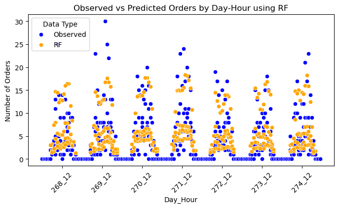

# Predicting Customers in Different Parts of Helsinki using different Deep Learning

This project is a demonstration of exploratory data analysis, showing my thought process during the problem structure: __Here you have data, make extractions, conclusions, predictions__.

### Research question: Based on weather forecast, in which part of Helsinki are we (food delivery service) going to receive orders from in a specific day and hour?

Understanding the customers' needs is of paramount desire in every type of customer-based business. Predicting the flow of orders can help to be one step ahead and plan accordingly to the demand. __Knowing the number of orders__ in different scenarios can help us answer the following:

- In what parts of Helsinki is there need for couriers?
- Should we focus on closing partnerships with restaurants in specific areas?
- Are there specific times where the demand for our services is higher/lower?

The above questions naturally suggest some features to be used in the prediction task:
- location,
- weather,
- time.

<div style="display: flex; justify-content: space-between;">
    
    
</div>


## Table of Contents

1. [Instructions](#instructions)
2. [Presentation](#presentation)
3. [Main Code](#main-code)
----

## Instructions

All the analysis and results are in jupyter notebook ```analysis.ipynb``` and presentation slides ```presentation.pdf```.

You can use the explicit specification files ```environment.yml``` to build an identical environment on your machine. It is not cross-platform. The platform it was created in is linux-x86_64.

Please note that on other platforms, the packages specified might not be available or dependencies might be missing for some of the key packages already in the spec.

Use the terminal for the following steps:

Create the environment from the environment.yml file:

```conda env create -f environment.yml```


Before running the main code in ```analysis.ipynb```, make sure that you're using the environment created from 'environment.yml'

<div style="display: flex; justify-content: space-between;">
    
    
</div>


## Presentation

Presentation slides in pdf (7 slides excl. title slide) is located in ```presentation.pdf```

<div style="display: flex; justify-content: space-between;">
    
    
</div>


## Main Code

<div style="display: flex; justify-content: space-between;">
    
    
</div>


All the coding was done in python using standard libraries like tensorflow, sklearn, numpy, pandas, etc. The code is located in a Jupyter Notebook ```analysis.ipynb```. I am importing some self-defined functions from ```preprocessing.py```, which uses similar libraries.

To run the code and see the results, open the Jupyter Notebook and run it cell by cell. Reading the markdown cells for better orientation is recommended. The chapters are roughly:
- Preprocessing data (scaling, clustering)
- Exploratory data analysis (descriptive statistics like counts, histograms, correlation)
- Modeling:
- - getting specific features, train-val-test splitting, scaling
- - Implementation of 5 different predictive models
- - Evaluation on test data
- Conclusions
- Further Development

